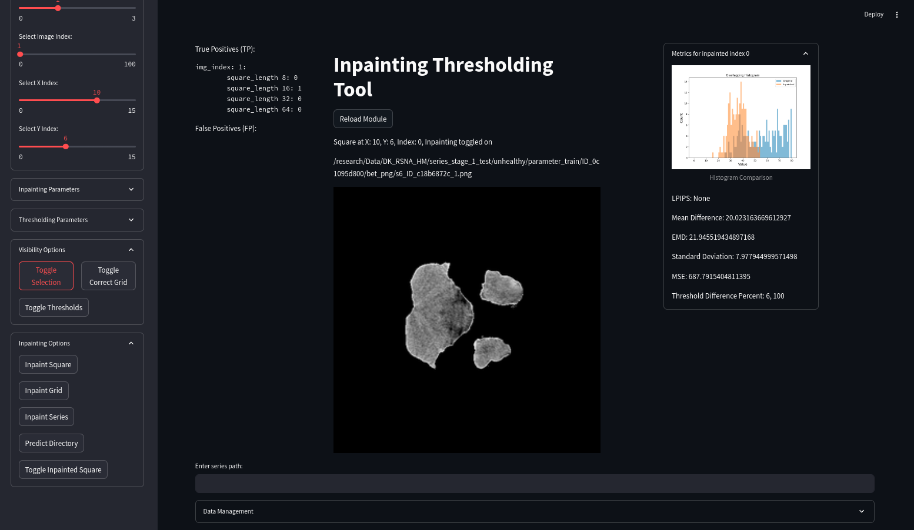
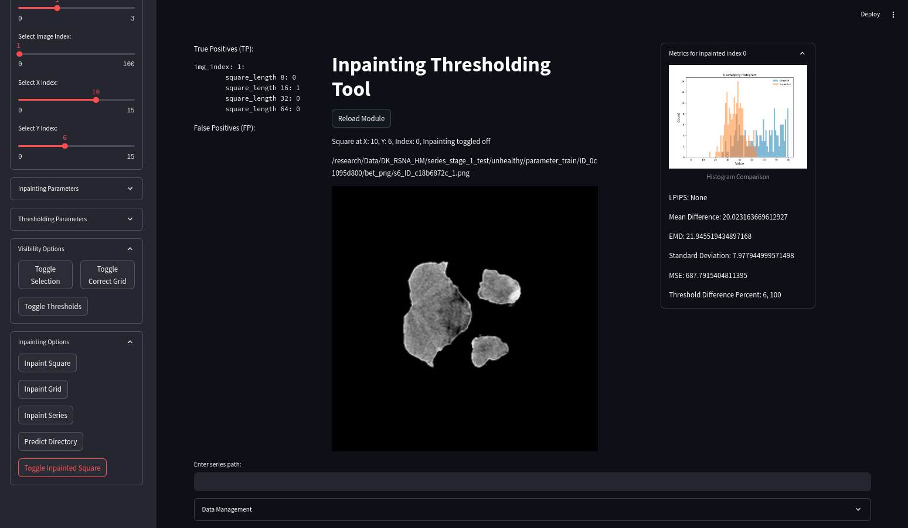
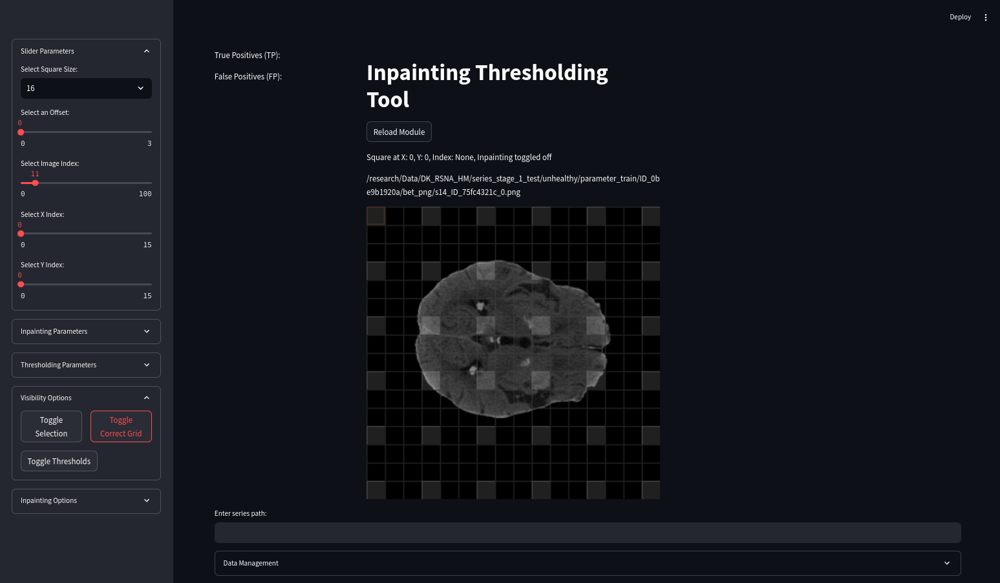

# About RSNA_Inpainting

Diffusion models have shown state-of-the-art performance on a number of image [inpainting tasks](https://paperswithcode.com/task/image-inpainting). The goal of this repositary is to document and store my project, which focuses on medical imaging usecase of inpainting, concretely on CT intercranial hemorrhage dataset provided by [RSNA](https://www.rsna.org/rsnai/ai-image-challenge/rsna-intracranial-hemorrhage-detection-challenge-2019). 

The core idea is that after the inpainting model learns on healthy distribution of brain CT images, it will be able to accurately inpaint healthy areas, which then can be compared to the original areas and thus anomalies can be detected in case of big differences.

<p align="center">
  
  
  
</p>


## Methodology 

### Preprocessing

RSNA data contains 5mm CT brain DICOM slices with hemorrhage type annotation, but within the scope of this project, only healthy/unhealthy annotation is required. Individual healthy DICOM slices are converted to NIfTI format, as it is required by the next preprocessing steps. 

NIfTI slices are brain extracted with a [robust brain extraction tool](https://github.com/aqqush/CT_BET), which provides us with mask of the brain area for each slice. Brain extracted slices are brain windowed(`center, width = 40, 80`)(as anomalies of interest are mostly detectable in this range) and saved as PNG(no loss of quality because range of intensities is 80HU). During training, images are resized with pad or crop to consistent shape of `(512, 512)` and subsequently resized with area interpolation to `(256, 256)` as models used are shown to be most efficacious for that image size.

### Detection 

To detect anomalies during inference, the inpainted area has to be small enough so that anomalies can be detected, while also big enough to cover most of the anomalous area. Also we do not now the area or location of the anomaly beforehand: For that reason, patch-wise inpainting strategy has been chosen, where individual squares on a grid are sequentially inpainted. Multiple square sizes `[8, 16, 32, 64]` with half-square offsets are utilized to ensure coverage of anomalies of various sizes. 

For detection itself, the idea is to detect the anomalous areas by simple thresholding. Finding the ideal metrics proved to be quite difficult, so a thresholding tool with streamlit has been developed to be able to visually see on a whole CT scan the results of various thresholding metrics and strategies. 

### Training

As for the inpainting model, fork of [mediffusion](https://github.com/BardiaKh/Mediffusion.git) package is utilized with additional implementation of resampling as described in [RePaint paper](https://arxiv.org/abs/2201.09865) under section 4.2. 

The training is conditioned on the extracted brain masks to preserve the shape of the inpainted areas, slices above and below the inpainted slice and the whole image besides the __inpainting mask__ area. 

**More about the inpainting masks:** 
There is an issue with the inference speed of diffusion models(1000 diffusion steps in original paper), especially considering the chosen patch-wise grid inpainting strategy, this issue is made even worse by the fact that the resampling strategy from RePaint slows down inference 10x-100x fold, so to resolve this, grid is inpainted in parallel as shown in the image below - 1/9th of the conditioning information is lost at the tradeoff of 9 inference runs per grid. 



## Bottlenecks

### Inference speed

For increased inference, [DDIM](https://arxiv.org/abs/2010.02502) inference is used, which decreases regular DDPM 1000 step inference protocol on which the model is trained 10x-50x fold. Even with DDIM, inpainting has to be done for the whole CT scan, which consists of 30-40 thick slices, each slice has to inpaint the whole grid, with different offsets and different square lengths. During resamplig from RePaint the `jump_length` could be reduced to 1 from 10, as DDIM protocol already saturates the jump benefits. 

In total on 1 A100, inpainting the whole series with DDIM50 sampling and the described grid inpainting strategy took ~25 minutes,.

### False positives

Even with the best inpainting settings, false positives occur way too often on healthy slices. Besides machine artifact, there are issues with brain cysts, and irregular brain atrophies, which do not neccessarily need to be there so it is reasonable that they are not inpainted. Additionaly, the anatomical accuracy of the inpainting seems to be lacking in some cases - meaning that the inpainted region would not be deemed reasonable by a radiologist even though it seems reasonable to untrained eye, which results in even more FP. Because of all these reasons, in practise balancing TP and FP proved difficult as setting thresholds to detect all desired anomalies resulted in FP on several slices on each CT scan.

## Installation

To install this project, I suggest using mamba as solving the enviroment with miniconda might take a while.

```bash
git clone https://github.com/yourusername/yourproject.git
cd yourproject
```
sdawda

